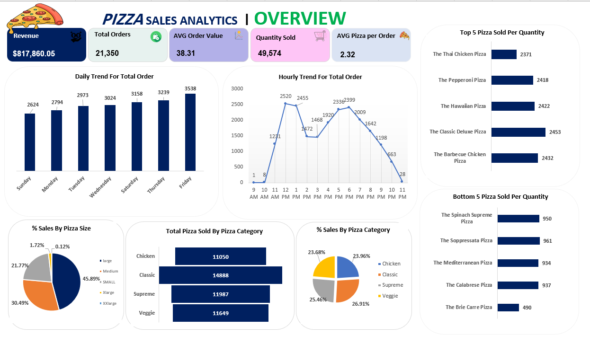

# 🍕 Pizza Sales Analysis Project (Excel & SQL)

## 🔍 Project Overview

This is an **educational data analysis project** focused on analyzing pizza sales data to extract meaningful business insights. The analysis was performed using **Excel** for data preparation and visualization, and **SQL** for querying and aggregating sales data.

The goal of the project is to understand sales performance, customer preferences, and peak sales periods to support data‑driven decision making.

---

## 🛠 Tools Used

* **Microsoft Excel**: Data cleaning, analysis, and dashboard creation
* **SQL**: Data extraction, aggregation, and analysis

---

## 📂 Project Structure

* `data/` : Excel dataset used for the analysis
* `sql/` : SQL queries used to extract insights
* `dashboard/` : Image of the sales dashboard created in Excel

---

## 📊 Key Analysis & Insights

The following insights were extracted from the pizza sales data:

### 💰 Revenue Analysis

* Total revenue generated from pizza sales was calculated.
* Revenue contribution was analyzed by pizza size and pizza category.

### 📦 Quantity Sold Analysis

* Total quantity sold was analyzed based on:

  * Pizza size (Small, Medium, Large, etc.)
  * Pizza category (Classic, Chicken, Veggie, etc.)

### ⭐ Top & Bottom Performing Items

* **Top 5 best‑selling pizzas** based on quantity sold.
* **Bottom 5 least‑selling pizzas** to identify underperforming items.

### ⏰ Time‑Based Sales Analysis

* Sales distribution across different hours of the day.
* Identification of **peak sales hours** to understand customer ordering behavior.

---

## 🖼 Dashboard Preview

---

## 📌 Conclusion

This project demonstrates how Excel and SQL can be combined to analyze sales data effectively. The insights generated can help businesses:

* Optimize product offerings
* Improve inventory planning
* Identify peak business hours
* Focus on high‑performing products

---

## 🎯 Purpose

This project is created for **learning and portfolio demonstration purposes** and showcases practical data analysis skills using real‑world sales data.
